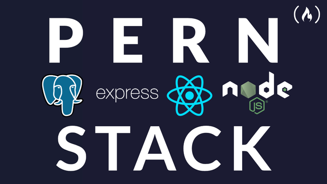
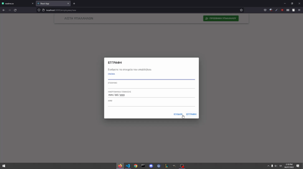

[](https://github.com/tterb/atomic-design-ui/blob/master/LICENSEs)

# CRUD-PERN-APP

A CRUD application created with PostgreSQL, Express, React and Node (PERN). It Creates,
Delete, Update and Get company employees.



## Usage



## Tech Stack

**Client:** React, TypeScript, MaterialUI

**Server:** Node, Express

## Demo

https://www.loom.com/share/ec198bf557184e70ad6e12961c8b68c8

## Heroku

https://crud-pern-applic.herokuapp.com/

## Installation

This project consists in a Web Frontend Application and a Web Backend Application.

First, clone the repo:

```bash
  git clone https://github.com/LamprosPapantoniou/CRUD-PERN-APP
```

To install the dependencies

```bash
  npm install
```

To run the Backend

```bash
  nodemon index
```

To run the Frontend

```bash
 cd client
 npm start
```

## Support

For support, email lampispapantoniou@gmail.com .

## Authors

-[@LamprosPapantoniou ](https://github.com/LamprosPapantoniou)
